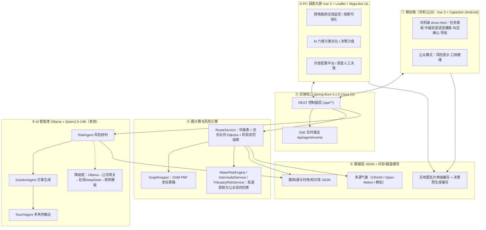
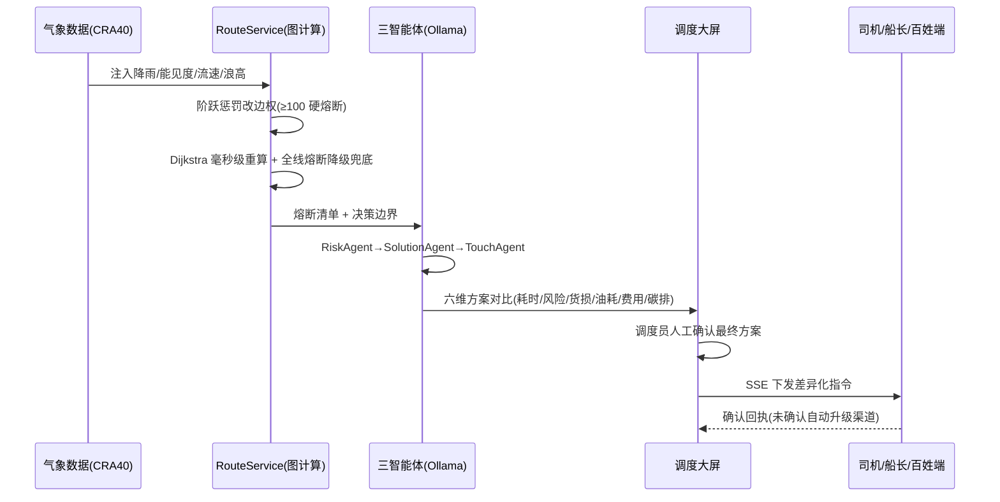
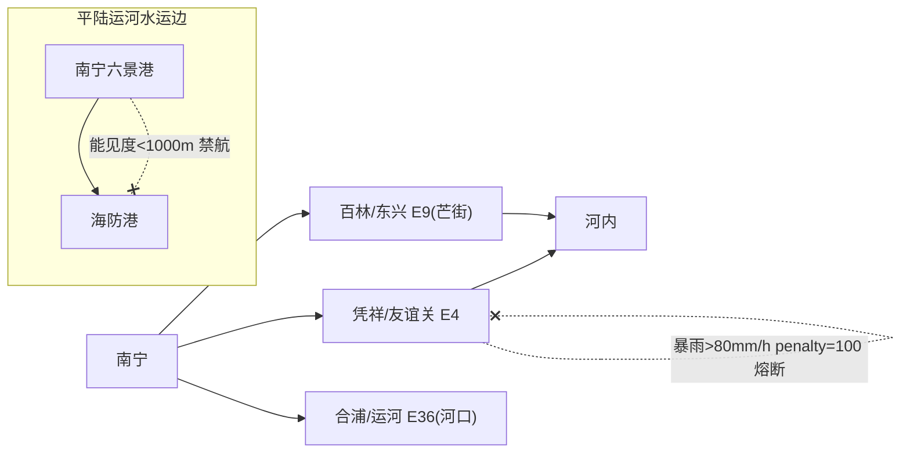

# 系统架构图与数据使用说明

## 一、总体六层架构图

## 二、核心决策链路（时序）

## 三、公—水动态边权共生模型示意

> 同一张有向图内，公路边与水运边共享边权内核；公路熔断时引擎自动评估水运边，水运禁航时反向评估公路边，实现双向共生备份。

---

## 四、数据使用说明

| 数据集 | 来源 | 授权/合规 | 在系统中的作用 | 是否含个人/敏感数据 |
|---|---|---|---|---|
| 中越跨境路网（`vietnam-road-network.json`） | OpenStreetMap 开源数据，团队自主清洗 + 口岸虚拟边修复 | ODbL 开源许可，需署名 | 图计算拓扑基础、路径规划载体 | 否 |
| 气象网格数据 | 大赛官方 CRA40 实况/预报接口（备源 Open-Meteo 公开气象） | 官方接口授权 / CC-BY 4.0 | 驱动动态边权熔断、风险研判输入 | 否 |
| 通关时效数据 | 政府公开公报、口岸运行公告整理 | 公开信息 | 方案耗时测算、拥堵评估 | 否 |
| 行业知识库（`knowledge-base.json`） | 《平陆运河通航安全管理规定》、跨境物流规范、企业规则 | 公开法规/自整理 | AI 决策解释依据、RAG 检索源 | 否 |
| 地图底图瓦片 | 天地图（同源代理）/ OSM / 本地矢量瓦片 | 天地图密钥授权、OSM 开源 | 大屏与司机端可视化 | 否 |
| 演示用货运数据 | 团队构造的模拟任务（司机、货物、船期） | 虚构样本 | 案例演示、任务下发闭环 | 否（全部虚构，不含真实个人信息） |

**数据合规声明：**
1. 全部敏感密钥（气象 Token、天地图密钥池、云端大模型 Key）仅存后端环境变量，前端与构建产物零密钥。
2. 核心 AI 推理与路径计算优先在本地 Ollama 完成；本地可用时业务数据不出硬件设备，符合《数据出境安全评估办法》。仅本地推理不可用且处于联网状态时，按降级链调用云端作为兜底。
3. 演示与测试数据均为团队构造，不涉及真实个人隐私与商业秘密。
4. OSM 派生数据遵循 ODbL 署名要求。
