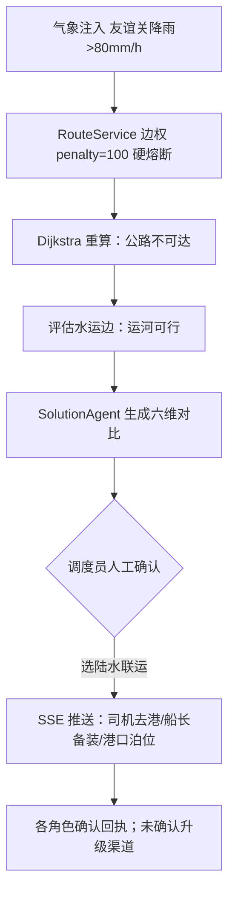
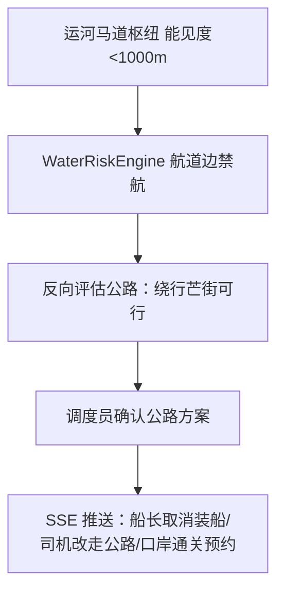

 # 服务设计可视化材料（服务蓝图 / 界面原型 / 流程示意）

## 一、服务蓝图（Service Blueprint）

| 层次 | 阶段1 风险感知 | 阶段2 方案生成 | 阶段3 人工决策 | 阶段4 分级触达 | 阶段5 闭环确认 |
|---|---|---|---|---|---|
| **用户动作**（调度员/司机/船长/百姓） | 收到风险预警提示 | 查看六维方案对比 | 调度员点选最终方案 | 各角色接收专属指令 | 点击"确认/Xác nhận"回执 |
| **前台界面** | 大屏红色熔断弹窗 / App 推送 | AI 多维分析面板 | 决策沙盘滑块 + 选择按钮 | 司机端任务变更卡片 / 语音播报 | 确认回执状态灯 |
| **后台支持** | WeatherSimulator 注入 + RouteService 阶跃熔断 | RiskAgent→SolutionAgent→TouchAgent（Ollama） | DecisionSandboxService 实时重估 | SSE /api/agent/events 广播 | TaskController /accept 记录回执 |
| **支撑系统** | CRA40 官方气象接口 / 本地缓存 | 知识库 RAG + 路网图 | 口岸时效 + 船期数据 | 天地图瓦片代理 + TTS | 决策日志 DecisionLogService |
| **粉线（互动线）** | 预警推送即互动 | 方案展示 | 人机协同确认 | 指令下发 | 回执闭环 |
| **绿线（可视分离线）** | 熔断计算对司机不可见，仅显结果 | AI 分析对百姓端不暴露 | 决策权归属人 | 分级渠道选择 | 未确认自动升级 |

### 分级叫应机制（三级）
```
黄色关注   → App 推送          → 需点击确认
橙色准备   → App + 短信         → 需回复确认
红色立即行动 → App + 语音外呼     → 未确认自动上报调度端并升级渠道
```

## 二、界面原型（文字版线框，供绘制原型图参考）

### 2.1 PC 调度大屏
```
┌───────────────────────────────────────────────────────────┐
│  顶部：全局态势条  [友谊关 85mm 熔断] [芒街 62mm 正常] [运河能见度 800m 禁航] │
├──────────────────────────────┬────────────────────────────┤
│                              │  AI 六维方案对比            │
│   地图区（Leaflet+MapLibre）  │  ┌────┬─────┬─────┬────┐   │
│   · 跨境路网骨骼图            │  │维度│芒街 │运河 │等待│   │
│   · 风险边(橙) 口岸虚拟边(红)  │  │耗时│1.5h │0.5h │6h  │   │
│   · 通畅绿/绕行红/基准灰虚线   │  │货损│4.8% │1.2% │8.5%│   │
│   · 决策沙盘滑块(调降雨量)     │  │... │     │     │    │   │
│                              │  └────┴─────┴─────┴────┘   │
│                              │  [选择陆水联运] [绕行芒街]   │
├──────────────────────────────┼────────────────────────────┤
│  三智能体状态灯 ●●●           │  决策日志时间线 / 叫应回执   │
└──────────────────────────────┴────────────────────────────┘
```
组件对应：`MapView.vue`(地图) `DecisionSandbox.vue`(沙盘) `AgentPanel.vue`(智能体) `RiskStrip.vue`(风险条) `CarbonCalc.vue`(碳排) `TaskDispatchPanel.vue`(派单) `PlatformConfigurator.vue`(配置器)。

### 2.2 司机端 App（DriverApp.vue）
```
┌───────────────┐
│  ZLN-Map 顶部  │
│  ┌─────────┐  │
│  │  地 图   │  │  任务变更卡片：
│  │ 导航路线 │  │  "原路线友谊关熔断，已切陆水联运，
│  │ 风险段红  │  │   请15:30前抵达六景港…"
│  └─────────┘  │  权益保障：随船补贴/专项险/返程交通
│ [卫星][矢量]   │  ▶ 越南语语音播报
│  ◉ 确认接收    │  ◉ Xác nhận（越南司机）
└───────────────┘
```

## 三、核心业务流程图

### 3.1 公路熔断 → 切陆水联运


### 3.2 水运禁航 → 反向切回公路


### 3.3 拔网线离线演示
```
本地 Ollama 推理 + CRA40 数据预缓存 + 本地算路 + 天地图磁盘瓦片缓存
→ 断网后重复全部流程，功能正常，数据不出境
```

## 四、产品形态矩阵

| 形态 | 技术 | 用户 | 核心功能 |
|---|---|---|---|
| PC 调度大屏 | Vue3+Leaflet+MapLibre | 调度管理人员 | 全局监控/熔断可视化/六维对比/沙盘/人工决策 |
| 移动端 App | Vue3+Capacitor | 司机/船东船员 | 执行指令/任务变更/双语语音播报/叫应确认 |
| 公众模式 | 同上（App 内） | 个体司机/沿岸百姓 | 基础导航+风险提示+避险预警（C端引流） |
| 开放配置平台 | Web | 物流企业 | 智能体模板/阈值配置/规则自定义（千企千面） |
